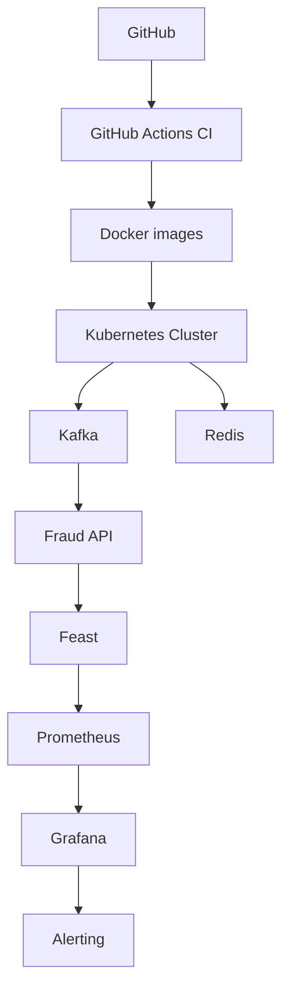

# Fraud Platform

## Architecture

```mermaid
graph TD
    A[GitHub] --> B[GitHub Actions CI]
    B --> C[Docker images]
    C --> D[Kubernetes Cluster]
    D --> E[Kafka]
    D --> F[Redis]
    E --> G[Fraud API]
    G --> H[Feast]
    H --> I[Prometheus]
    I --> J[Grafana]
    J --> K[Alerting]
```
