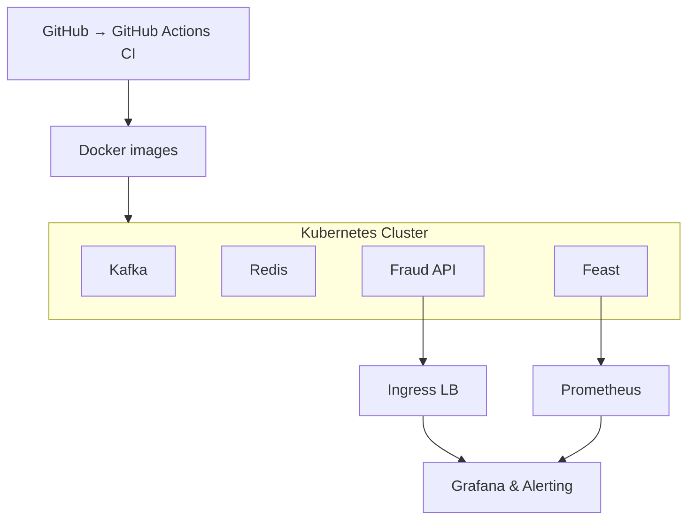

# 🛡️ Real-Time Fraud-Detection Platform

End-to-end template for streaming ingest → feature engineering → model training/serving → monitoring, built with **Kafka / Flink / Feast / FastAPI / Kubernetes**.  
Structured to start locally with Docker, then lift the same manifests to any K8s cluster.

---

## 📌 Table of Contents
1. [At-a-Glance](#at-a-glance)
2. [Architecture](#architecture)
3. [Getting Started](#getting-started)
4. [Development Workflow](#development-workflow)
5. [Repository Structure](#repository-structure)
6. [Observability](#observability)
7. [Performance Targets](#performance-targets)
8. [Contributing](#contributing)

---

## At-a-Glance

| Stack Layer | Tech | Notes |
|-------------|------|-------|
| **Ingest** | Kafka | JSON streaming, 6+ partitions |
| **Feature Store** | Redis | Online feature serving |
| **Model Serving** | FastAPI | Real-time inference |
| **Storage** | MinIO/S3 | Raw event archival |
| **Observability** | Prometheus, Grafana | Metrics & dashboards |
| **CI/CD** | GitHub Actions | Automated builds |

## Architecture



## Getting Started

1. **Clone & Setup**
   ```bash
   git clone https://github.com/colinthekkinedath/fraud-platform
   cd fraud-platform
   ```

2. **Local Development**
   ```bash
   # Start local stack
   make bootstrap-local
   
   # Verify services
   docker compose -f docker-compose.local.yml ps
   ```

3. **Generate Test Data**
   ```bash
   # Run producer with 500 TPS
   make seed
   ```

## Development Workflow

1. **Local Testing**
   - Start services: `make up`
   - Create topics: `make wait-topics`
   - Setup S3 sink: `make setup-connector`

2. **Code Quality**
   - Run linting: `make lint`
   - Run tests: `make test` (coming soon)

## Repository Structure

```
.
├── docker-compose.local.yml     # Local development stack
├── services/
│   ├── producer/               # Transaction generator
│   ├── quality/               # Data validation
│   └── sink/                  # S3 archival
├── pipelines/
│   └── kafka-connect/         # Connector configs
├── data/
│   └── schemas/              # Avro schemas
├── docs/
│   ├── metrics.md           # Performance baselines
│   └── adr/                 # Architecture decisions
└── Makefile                 # Development commands
```

## Observability

- **Metrics**
  - Producer throughput: `rate(producer_messages_sent_total[5m])`
  - Latency p95: `histogram_quantile(0.95, producer_send_latency_seconds)`
  - Error rate: `rate(producer_send_errors_total[5m])`

- **Dashboards**
  - Grafana: http://localhost:3000 (admin/admin)
  - MinIO: http://localhost:9001 (admin/password123)
  - Kafka Connect: http://localhost:8083

## Performance Targets

| Metric | Target |
|--------|--------|
| Ingest Rate | 1000+ TPS |
| p95 Latency | < 10ms |
| Error Rate | < 0.1% |
| Availability | 99.9% |

## Contributing

1. Fork the repository
2. Create feature branch (`git checkout -b feature/xyz`)
3. Commit changes (`git commit -am 'Add feature xyz'`)
4. Push branch (`git push origin feature/xyz`)
5. Open Pull Request

---

## License

Apache 2.0 - See [LICENSE](LICENSE) for details.
