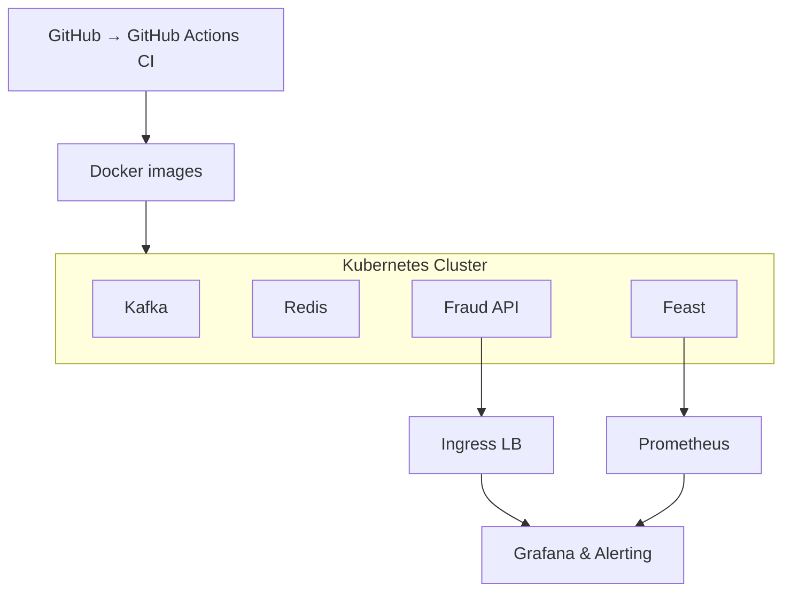

# Fraud Platform

## Architecture

```mermaid
graph TD
    A[GitHub → GitHub Actions CI] --> B[Docker images]
    B --> C[Kubernetes Cluster]

    subgraph C[Kubernetes Cluster]
        C1[Kafka]
        C2[Redis]
        C3[Fraud API]
        C4[Feast]
    end

    C3 --> D[Ingress LB]
    C4 --> E[Prometheus]

    D --> F[Grafana & Alerting]
    E --> F
```
